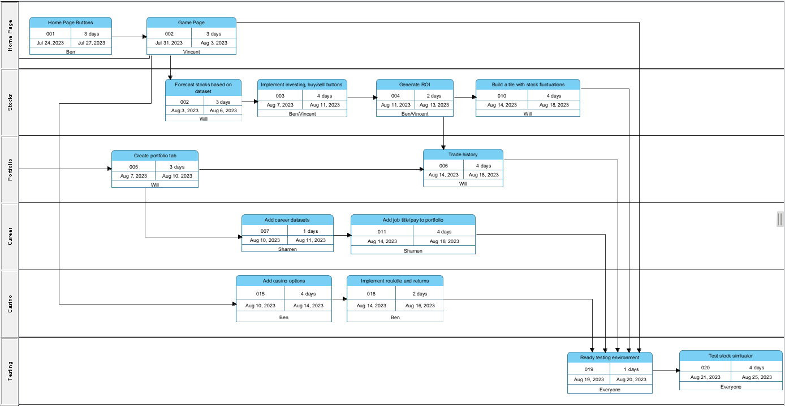

# COSC345 Assignment 1

## Introduction

### Our idea/scope of our project

Our idea is a stock market simulator game. The objective of the game is to generate as much money as you can over the 100 years of your life. Everyone starts with a million US dollars and must use stocks, property, ETFs, precious metals, cryptocurrency, and more to generate income. Players can even get an education and a job in the game to earn extra income. High scores are stored in an online leaderboard.

There are two modes that will be supported for our game; a real-world trading game which uses current stock market data in real time, and a simulated trading game in which historical data is accurate but future data is generated based on the historical data (stock prices and financial news). The future data is generated with a degree of randomness for every playthrough, and years can be skipped to keep the game fast and arcade-y. We will also add a casino featuring blackjack, slots, and roulette. To prevent the leaderboards from being filled with players who have gambled all their money repeatedly, we will have to limit the amount a player can earn from the casino.

If we have extra time at the end, we would like to add options trading and starting your own business. We believe these would take up too much time if we try to implement them from the start.

## Group Members:

### Ben Knox
Ben has studied Finance and Computer Science at Otago. The knowledge attained from his finance degree will help in the implementation of trading stocks. He is most comfortable coding in Python and Java but has some knowledge of C and C++. His coding experience leans more towards backend development. However, he is open to learning different concepts for UI creation as needed. He will provide help in generating backend functionality to parts of the game.

### Shamen Kumar
Shamen, who is in his third year of studying computer science, is eager to make valuable contributions through the programming skills he has developed so far. Although his experience with C++ is limited, he is determined to enhance his skills in the language and leverage his current coding abilities to support the group's efforts in any way possible. With a collaborative approach, Shamen looks forward to both learning from fellow group members and actively contributing to the project's needs.

### Vincent Lee
With a background in Finance and Computer Science, Vincent's expertise will be helpful in designing realistic market scenarios and ensuring the accuracy of the game mechanics. Despite not having extensive experience in C++, he is eager to contribute in any way he can. He thrives in a team environment and will use his communication and management skills to ensure the group is on track with their project. Vincent's adaptable nature means he doesn't mind what task to do and is willing to take on any role needed to support the team's success. 

### Will Frame
Will is a third year Computer Science student minoring in Information Science. He has been interested in stocks for a few years now as some of his family work in the field, and he has played a few investment simulator games in the past. He also completed COSC360 (the game design paper) which could be very useful for this project/idea. He is proficient in Python and Java, with little C and C++ experience. Will is going to be mostly focused on programming, data processing, and game design.

### Purpose of the Requirements Document

The purpose of this document is to provide an in-depth description of the requirements for our game, as well as a plan for development. The document achieves this by presenting a clear view of requirements of the system. It will serve as a basis and/or outline for the software design, development, and management. 

### Datasets

Our main dataset is NASDAQ's and the NYSE's historical stock data. The NASDAQ website (https://www.nasdaq.com/market-activity/quotes/historical) and the NYSE website (https://www.nyse.com/market-data/historical) both provide historical data for almost all of the stocks listed under the NASDAQ and NYSE.

Another dataset we will use is a US housing data (https://www.kaggle.com/datasets/paultimothymooney/zillow-house-price-data). This will be used to give the players an alternative investment to typical stocks. This dataset has rental pricing as well as housing pricing by number of rooms. Investment properties in the game will also generate rent once someone moves in.

Another dataset we will use is a stock news with sentiment dataset (https://www.kaggle.com/datasets/ankurzing/sentiment-analysis-for-financial-news). This will be used to assist in generating news headlines for companies as well as their impact on company stocks.

We may also use a majors with salaries dataset (https://www.kaggle.com/code/cdelany7/exploration-of-college-salaries-by-major) to calculate how much players earn depending on their chosen education and job.

Our datasets complement each other as they can form a cohesive simulated investment economy. This opens the door for education and enjoyment by giving players the opportunity to see first hand how much they could earn if they owned a million dollars in cash.

### Scheduling

To ensure we meet our assignment timeline, we have devised a PERT chart outlining the schedule for each team member, aiming to complete a working alpha version on time. Once the alpha version is released, we will reevaluate our schedule and create another PERT chart to ensure the beta version is completed within the designated time frame.

## Requirements

### Functional requirements

- Stock Market Trading

Players must be able to buy and sell stocks to make profit.

- Real Estate Trading

Players must be able to buy, sell, and rent out properties in order to make profit.

- Job and Education Simulation

Players must be able to choose an education and job to make some extra money alongside their investments.

- Updating Leaderboard

The online leaderboard should be updated with users showing the highest growth.

- Economic Simulation with news headlines

The game must simulate an economy with news headlines ingame that impact stock prices or different parts of the economy.

- Portfolio Management

Players must be able to manage their portfolio, being able to easily buy and sell stocks at any available quantity.

- Real time data updating

Players of the real world mode must be able to receive real updated stock data daily.

### Non-functional requirements

- Fun

The game must be engaging and satisfying to keep players interested.

- Intuitive UI

The user interface must be easily understandable, allowing players with no knowledge of the stock market can pick it up with ease. The UI should not be cluttered and should display only the required information to the user.

- Less than 2 second load time for each year of data

The software and data processing/collection must be optimized to ensure smooth gameplay without interruptions, aiming for a load time of less than 2 seconds for each year of data

- C++ program

The packaged application must be implemented in C++ in accordance with the project requirements.

- Must compile with most C++ compilers

Our program must be built with standard and widely supported C++ libraries, so it will compile on as many compilers as possible (such as GCC and Clang).

- Server uptime for the leaderboard

The leaderboard should have high availability to provide consistent access to players. 

- Ultralight for GUI

We decided on using Ultralight for our GUI rendering. Ultralight is a lightweight UI toolkit making use of HTML and CSS, which are familiar languages for our team.

### General constraints (as per the assignment):

- No multithreading

As per the requirements we aren't allowed to use multithreading on the CPU.

- GUI must be simple to prevent it taking up too much of our time

Using HTML and CSS should significantly reduce the amount of time required to build the GUI, however we still need to keep simplicity in mind as to not add to the amount of time required for development.

- Testing (GTest looks pretty good?)

While we are still deciding on the specific testing tools to use, GTest seems to be a popular option.

- CI/CD (unsure)

We will have to ask for clarification on what is required for CI/CD. We plan to set up automated build actions and testing for each commit.

- Documentation (Doxygen)

As per the suggestion in the assignment requirements we will use Doxygen for documentation. 

### Specific requirements

### Form Based Requirements

| Functionality | Inputs | Outputs | Action |
| ------------- | ------ | ------- | ------ |
| Stock Market Trading | Stock symbol, number of shares, buy/sell order | Confirmation of successful transaction, updated portfolio | The system should update the user's portfolio and account balance based on the transaction |
| Job and Education Simulation | Choice of education or job | Degree, job title and income | The system should update the user's income based on their education and job |
| Leaderboard Update | Player scores | Updated leaderboard | The system should rank players based on their growth over the past month or year and update the leaderboard |
| Economic Simulation | Real-world economic data | Simulated market prices, interest rates, etc. | The system should adjust the simulated economy based on real-world data |

### Domain specific requirements

| Requirement | Description |
| ----------- | ----------- |
| Stock Market Data | The game should have access to real-time and predicted stock market data to simulate real-world trading. This includes data for stocks, ETFs, precious metals, and cryptocurrencies. |
| Property and Asset Management | Players should be able to buy and sell properties as investments. The game should simulate the process of buying a property, including other costs and potential returns from renting the properties out if desired. |
| In-Game Economy | The game should simulate a realistic economy, with fluctuations in market prices, interest rates, and news headlines that may have an impact on stock prices or the economy. |

## Similar products and evidence of customer interest

The most popular three similar products are "MarketWatch Virtual Stock Exchange", "The Stock Market Game", and "Investopedia Simulator". "MarketWatch Virtual Stock Exchange" and "The Stock Market Game" have lengthy signup processes that collect a large amount of data. "Investopedia Simulator" is the product the closest to what we hope to achieve, with a simple UI for the features we plan to implement, as well as a very simple starting process. It has over a million users, which shows there is customer interest for games like ours. The downfall of "Investopedia Simulator" is that alike the other similar products, there is no simulated economy. As a result, the pacing of the game is extremely slow.

There are a lot of business simulators and stock market simulator games, in which share the same objective as ours - make as much money as possible. We also believe the educational value of our stock market simulator could be useful to a larger customer base, teaching people to recognize how stock prices interact with financial news regarding companies.
